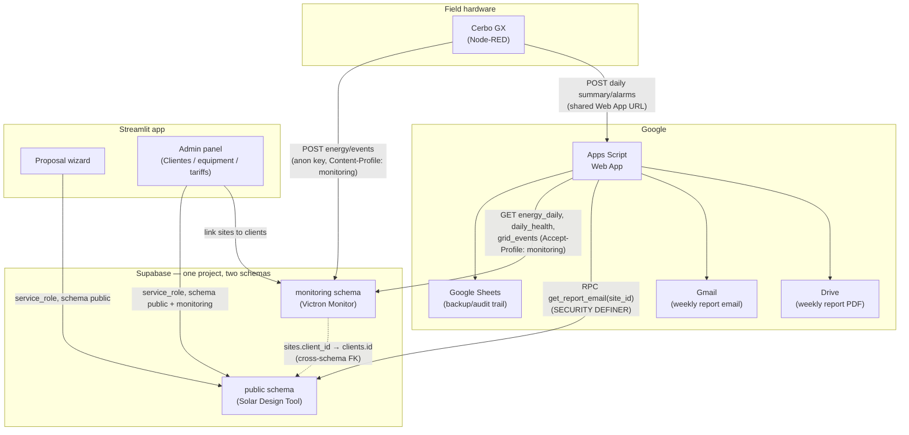
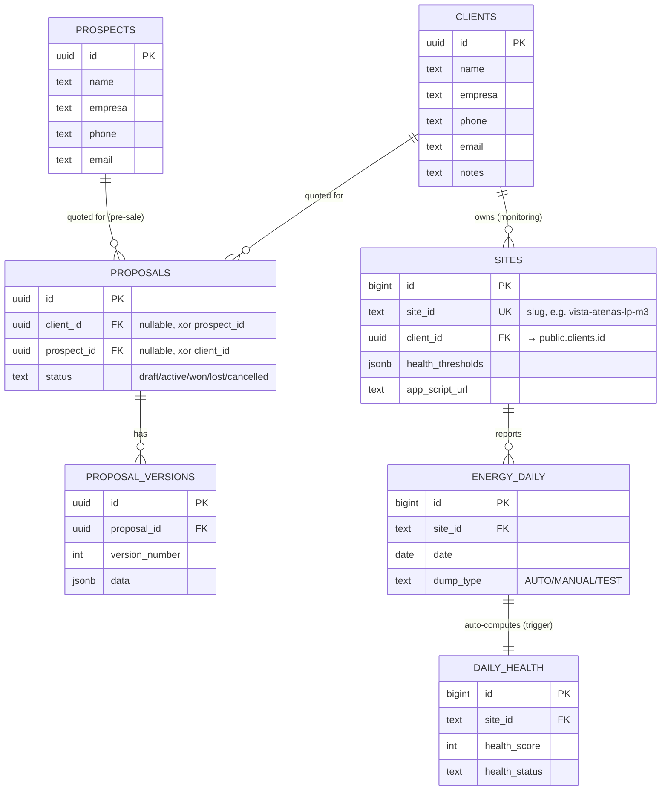
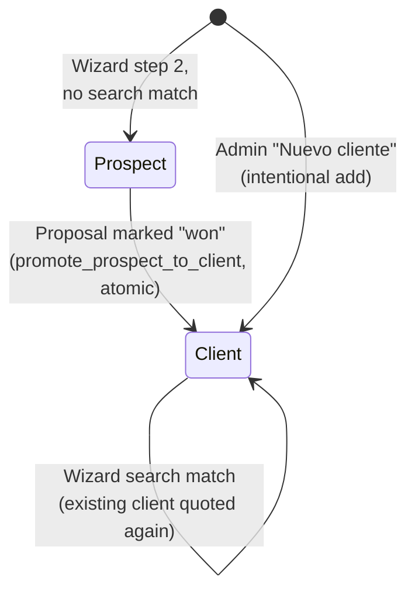

# System Architecture

How the two products in this repo — the **Solar Design Tool** (Streamlit) and **Victron Monitor** (Node-RED + Apps Script) — are wired together through one shared Supabase project. See [README.md](README.md) for what each product does; this doc is about how the pieces connect.

---

## 1. System wiring

**Three independent write paths into `monitoring`, one read path back out:**
- Node-RED writes telemetry directly (energy, alarms, grid events, MPPT snapshots, diagnostic logs)
- A Postgres trigger on `energy_daily` inserts computes `daily_health` automatically (no app writes it)
- Apps Script only *reads* from `monitoring` — it never writes there; Sheets is still the write target for the human-browsable backup

**Two different credential models, deliberately:**
- Streamlit (server-side, trusted) → `service_role`, full access, no RLS needed
- Node-RED + Apps Script (untrusted — device firmware / Google's servers, not yours) → `anon` key, schema-level `GRANT`s (no RLS), narrowly scoped by what each table actually needs exposed

---

## 2. Supabase schema map

`public` (Solar Design Tool) and `monitoring` (Victron Monitor) are otherwise fully isolated — the **only** cross-schema link is `monitoring.sites.client_id → public.clients.id`, and it's read/written through a narrow `SECURITY DEFINER` function (`get_report_email`), not a direct grant on `clients` to the `anon` key. Full table list per schema in [database/schema.sql](database/schema.sql) (`public`) and [victron-monitor/sql/schema.sql](victron-monitor/sql/schema.sql) (`monitoring`).

---

## 3. Client lifecycle (the prospect → client bridge)

- A **prospect** is anyone who's been quoted but hasn't bought — created automatically by the wizard, never by hand
- A **client** is anyone who has bought, or was added intentionally via Admin
- Promotion is atomic and happens exactly once, at the moment a proposal is marked **won** (`pages/01_proposals.py`) — the prospect row is deleted, not kept, and every proposal that referenced it is repointed to the new client
- Once a `monitoring.sites` row is linked to a client (Admin → Clientes → checkbox linker), that client's `email` is what the weekly Victron report gets sent to (`get_report_email` RPC) — no email until a link exists

---

## 4. Where each piece actually runs

| Component | Runs where | Deployed how |
|---|---|---|
| Solar Design Tool | Local Mac (Streamlit), `service_role` key | `streamlit run app.py` |
| Node-RED flow | Victron Cerbo GX (Venus OS), `anon` key via credential env var | Import `victron-monitor/node-red/victron_monitor_v1p8.json` |
| Apps Script | Google's servers, container-bound to the Victron_Events Sheet | Paste `victron-monitor/apps-script/Victron_Events_App_Script_v1p7.js`, deploy as Web App |
| Supabase | Managed, one project (`qqorjwnlawhlmrmxxgdb`) | Migrations in `database/migrations/`, applied via SQL Editor |

Bootstrap credentials that can't live in the database (chicken-and-egg — needed to reach Supabase in the first place):
- Node-RED: `SUPABASE_ANON_KEY` as a Global Environment Variable, type `credential`
- Apps Script: `SUPABASE_URL` / `SUPABASE_ANON_KEY` as Script Properties
- Streamlit: `.env` (gitignored)

Everything else — site specs, health thresholds, report email routing, Apps Script URL per site — is DB-driven and requires no redeploy to change.
